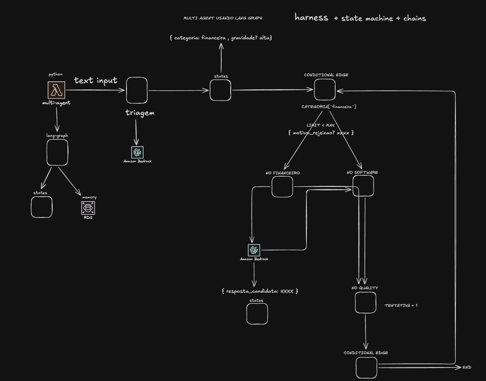

# AGENT-TASK-TRIAGE

**Triage** agent built with **LangGraph** (graph orchestration) and a **provider-agnostic LLM layer** (Amazon Bedrock, Ollama, or any OpenAI-compatible API).

## Architecture

How the system works — **harness + state machine + chains**: `text input` goes
through **triagem** (Amazon Bedrock) into the shared `states`, a **conditional
edge** routes by `CATEGORIA["financeira"]` to the category node (`NO FINANCEIRO`
/ `NO SOFTWARE`) while `LIMIT < MAX`, each node produces a `resposta_candidata`
that **NO QUALITY** scores (`TENTATIVA + 1`), and the last **conditional edge**
either reaches `END` or loops back to the first one carrying `motivo_rejeicao`.



```
src/
├── api.py               # HTTP transport (FastAPI): /health and /triage endpoints
├── main.py              # CLI entrypoint: executes the graph with example messages
├── actions/             # Business logic (framework-agnostic)
│   ├── base.py          # I/O schemas (TriageRequest / TriageResponse)
│   └── triage.py        # process_triage(): orchestrates the graph
├── ai/
│   ├── agent.py         # LangGraph graph with conditional edges + quality loop
│   ├── llm.py           # LLMFactory (facade over the provider registry)
│   ├── states.py        # TriageState + TriageResult + QualityResult
│   ├── providers/       # ModelProvider abstraction + concrete transports
│   │   ├── base.py      # ModelProvider interface + ProviderRegistry
│   │   ├── bedrock.py   # Amazon Bedrock (via ChatBedrockConverse)
│   │   ├── ollama.py    # Local open-source models (Ollama)
│   │   └── openai.py    # Any OpenAI-compatible API (OpenAI, vLLM, LM Studio...)
│   ├── tools/           # Executor tools by category (financial / software)
│   └── prompts/         # Agent prompts (constants.py)
└── config/
    ├── envs.py          # Settings via pydantic-settings + .env
    ├── aws.py           # AWSClientManager (boto3 Session/clients)
    └── logging.py       # Logging setup
```

### Graph flow (LangGraph concept)

```
START → triage
          │  (conditional edge by category)
          ├── financial ──→ financial_node ──┐
          └── software  ──→ software_node   ──┤
                                              ▼
                                          quality
                                              │  (conditional edge)
                    ┌─────────────────────────┼──────────────────────┐
              approved                   rejected &            rejected &
                    │                    attempts < 3         attempts >= 3
                    ▼                          │                      ▼
                finalize → END       back to previous tool      finalize → END
                                     (with rejection_reason)
```

1. **`triage`** — **fast** model with `with_structured_output(TriageResult)`
   classifies into `financial` or `software` (+ `priority` + `reasoning`).
2. **conditional edge** — [`route_by_category`](src/ai/agent.py:118) directs to the category tool.
3. **`financial_node` / `software_node`** — each tool resolves the request (model **large**)
   and increments `attempts`. On retry, receives the `rejection_reason` from the previous round.
4. **`quality`** — **LLM-as-judge evaluation** that assesses the agent response with multiple
   dimensions (relevance, accuracy, completeness, clarity, tone, conciseness). Returns `approved`
   (+ `rejection_reason` if rejected). See **[Evaluation System](#llm-as-judge-evaluation)** below.
5. **conditional edge** — [`route_after_quality`](src/ai/agent.py:125): approved → `finalize`;
   rejected and `attempts < 3` → back to tool; `attempts >= 3` → `finalize` (ends).
6. **`finalize`** — assembles the final response to the user.

The state (`TriageState`) is a `TypedDict` that travels between nodes; each node returns a
partial `dict` that LangGraph merges into the state. Loop control fields:
`work_result`, `quality_approved`, `rejection_reason`, `attempts` (cap = 3).

### Two-Layer Evaluation

The system implements **two-layer evaluation** to ensure maximum quality:

#### 1. Quality Node (LLM-as-Judge) - Retry Loop
Evaluation during the iterative process ([`src/ai/evaluation/`](src/ai/evaluation/)):
- **Simple** (default) — fast evaluation, compatible with previous system
- **Detailed** — multi-dimensional evaluation with 6 criteria (relevance, accuracy, completeness, clarity, tone, conciseness)
- Action: If rejected, **retries up to 3 times** with feedback

**Configuration:**
```bash
MODEL_JUDGE=us.anthropic.claude-sonnet-4-5-20250929-v1:0
EVAL_MODE=simple  # or 'detailed'
```

#### 2. Finalize Node (Bedrock Native Judge) - Final Validation
**Final evaluation** using AWS Bedrock before sending to user ([`src/ai/evaluation/bedrock_evaluator.py`](src/ai/evaluation/bedrock_evaluator.py)):
- Uses Bedrock's native evaluation capabilities
- Applied after quality_node approval
- Action: If rejected, **adds warning** but sends response (fail-safe)

**Configuration:**
```bash
ENABLE_BEDROCK_JUDGE=true  # Enables final evaluation
BEDROCK_JUDGE_MODEL_ID=us.anthropic.claude-sonnet-4-5-20250929-v1:0
BEDROCK_EVAL_TYPE=quality  # quality, accuracy, or helpfulness
```

**Test endpoints:**
- `POST /evaluate` — tests LLM-as-judge evaluation
- `POST /evaluate/detailed` — detailed evaluation with scores

**Documentation:**
- [`docs/EVALUATION.md`](docs/EVALUATION.md) - Complete LLM-as-judge system
- [`docs/BEDROCK_EVALUATION.md`](docs/BEDROCK_EVALUATION.md) - Bedrock native evaluator integration

## Setup

```bash
# 1. Install dependencies (using uv, like other agents)
uv sync

# 2. Configure environment
cp .env.example .env

# 3. AWS credentials with Bedrock access (boto3 standard profile/variables)
export AWS_PROFILE=your-profile   # or AWS_ACCESS_KEY_ID / AWS_SECRET_ACCESS_KEY
```

## Model providers (base_url strategy)

Model access is **agnostic**: the code depends on the
[`ModelProvider`](src/ai/providers/base.py) abstraction, not on concrete
implementations. Each transport (Bedrock, Ollama, OpenAI-compatible) is a class
that implements this interface and **self-registers** in the `ProviderRegistry`.
The `LLMFactory` ([`src/ai/llm.py`](src/ai/llm.py)) is just a facade.

The transport is **derived from the `base_url`** (`resolve_transport`), not
declared:

| `LLM_BASE_URL` / `EMBED_BASE_URL` | Transport |
|-----------------------------------|-----------|
| *(empty)* | Bedrock (AWS credentials) |
| `http://localhost:11434` | Ollama (local open-source models) |
| any other | OpenAI-compatible API (api.openai.com, vLLM, LM Studio, OpenRouter...) |

Models use the **same variables** on any transport: `MODEL`, `MODEL_FAST`,
`MODEL_JUDGE` (default = `MODEL`), `EMBED_MODEL`, `EMBED_DIMENSIONS`. The key
for OpenAI-compatible transports is `LLM_API_KEY` (default = `OPENAI_API_KEY`
from the environment).

**Example — fully local with Ollama (Llama + nomic-embed-text):**

```bash
# 1. Install and start Ollama, then pull the models
ollama pull llama3.1
ollama pull nomic-embed-text

# 2. In .env
LLM_BASE_URL=http://localhost:11434
MODEL=llama3.1
MODEL_JUDGE=llama3.1:70b   # optional: more capable judge
EMBED_BASE_URL=http://localhost:11434
EMBED_MODEL=nomic-embed-text
EMBED_DIMENSIONS=768
```

**Example — OpenAI embeddings + local LLM:**

```bash
# In .env
LLM_BASE_URL=http://localhost:11434
MODEL=llama3.1
EMBED_BASE_URL=https://api.openai.com/v1
EMBED_MODEL=text-embedding-3-small
EMBED_DIMENSIONS=1536
LLM_API_KEY=sk-...   # or export OPENAI_API_KEY in the environment
```

> **Vector dimension:** the Postgres `embedding` column is created with a fixed
> dimension in the migration ([`001_create_pgvector_schema.py`](migrations/versions/001_create_pgvector_schema.py),
> `Vector(1024)` for Titan). Each embedding model has its own dimension
> (Titan=1024, text-embedding-3-small=1536, nomic-embed-text=768).

## Run

### Option 1 — HTTP API (FastAPI)

```bash
PYTHONPATH=src uv run uvicorn api:app --host 127.0.0.1 --port 8000 --reload
```

Endpoints:

- `GET /health` — healthcheck
- `POST /triage` — send a message for triage
- `GET /docs` — interactive Swagger UI

Example call:

```bash
curl -X POST http://127.0.0.1:8000/triage \
  -H "Content-Type: application/json" \
  -d '{"message":"My system is down and I cannot work!"}'
```

Response:

```json
{
  "category": "software",
  "priority": "urgent",
  "reasoning": "Unavailable system preventing user from working...",
  "response": "Hello! We received your request with urgent priority..."
}
```

### Option 2 — CLI (examples)

```bash
PYTHONPATH=src uv run python src/main.py
```

## Frontend (chat)

Chat interface in **Next.js + Tailwind**, in [`frontend/`](frontend), that connects
to the `/triage` endpoint.

```bash
# 1. Start the backend (port 8000)
PYTHONPATH=src uv run uvicorn api:app --host 127.0.0.1 --port 8000

# 2. In another terminal, start the frontend (port 3000)
cd frontend
npm install
npm run dev
```

Access **http://localhost:3000**. The API URL is configurable via
[`frontend/.env.local`](frontend/.env.local) (`NEXT_PUBLIC_API_URL`).

CORS is already enabled in the backend ([`src/api.py`](src/api.py)) for
`localhost:3000`. Each sent message appears with the **category** and
**priority** classified by the agent, plus the justification.

## RAG (embeddings + pgvector)

**RAG** pipeline that generates embeddings via the configured embedding provider
(default: **Amazon Titan Text Embeddings v2**, 1024 dimensions) and stores them
in a local **Postgres + pgvector** (Docker).

```bash
# 1. Start Postgres with pgvector extension (host 5433 -> container 5432)
docker compose up -d

# 2. The .env already points DATABASE_URL to localhost:5433/rag
#    (psycopg v3 driver, required by langchain-postgres)

# 3. Apply migrations (creates vector extension + RAG tables)
uv run python migrate.py
```

> The API also runs `alembic upgrade head` automatically on startup
> ([`_run_migrations`](src/api.py:28)), so in local environment step 3 is
> optional. See the **Migrations** section below.

Components:

```
src/ai/
├── attachments/parsers/  # txt / md / pdf parsing (pypdf)
└── rag/
    ├── vectorstore.py     # PGVector (lazy singleton) + configured embed model
    ├── ingest.py          # chunking (RecursiveCharacterTextSplitter) + embed + store
    └── retriever.py       # similarity_search + build_context
```

Endpoints:

- `POST /rag/ingest` — indexes plain text
- `POST /rag/ingest/file` — indexes an uploaded file (`txt` / `md` / `pdf`)
- `POST /rag/search` — semantic search of the most relevant chunks

```bash
# Ingest text
curl -X POST http://127.0.0.1:8000/rag/ingest \
  -H "Content-Type: application/json" \
  -d '{"text":"The refund policy allows reversal within 7 business days.","source":"policy"}'

# Ingest file (with optional metadata)
curl -X POST http://127.0.0.1:8000/rag/ingest/file \
  -F "file=@/path/manual.md" \
  -F 'metadata={"category":"support"}'

# Search
curl -X POST http://127.0.0.1:8000/rag/search \
  -H "Content-Type: application/json" \
  -d '{"query":"what is the reversal deadline?","k":3}'

# Search with metadata filter (restricts before measuring similarity)
curl -X POST http://127.0.0.1:8000/rag/search \
  -H "Content-Type: application/json" \
  -d '{"query":"what is the deadline?","k":3,"filter":{"category":"financial"}}'
```

**Metadata filter** (`filter`, optional): restricts the search universe by
`cmetadata` **before** ordering by similarity. Uses the `langchain-postgres`
mini-language (`$eq`, `$ne`, `$in`, `$nin`, `$gt`, `$lt`, `$and`, `$or`):

```jsonc
{"category": "support"}                       // equality
{"source": {"$in": ["sla.md", "faq.md"]}}      // belongs to a set
{"$and": [{"category": "support"}, {"chunk_index": {"$gt": 0}}]}
```

The GIN index `ix_cmetadata_gin` speeds up this filter. Chained in
[`retriever.search`](src/ai/rag/retriever.py:14) → [`search_documents`](src/actions/rag.py:80)
→ endpoint `/rag/search`.

Relevant configurations ([`src/config/envs.py`](src/config/envs.py:1)):
`EMBED_MODEL`, `EMBED_DIMENSIONS`, `DATABASE_URL`, `RAG_COLLECTION`,
`RAG_CHUNK_SIZE`, `RAG_CHUNK_OVERLAP`, `RAG_TOP_K`.

### Inspect / search in DBeaver

**Connection** (New Connection → PostgreSQL):

| Field    | Value       |
|----------|-------------|
| Host     | `localhost` |
| Port     | `5433`      |
| Database | `rag`       |
| Username | `postgres`  |
| Password | `postgres`  |

`langchain-postgres` creates two tables:

- `langchain_pg_collection` — `(uuid, name)`; each collection (e.g.: `documents`).
- `langchain_pg_embedding` — `(id, collection_id, embedding vector, document, cmetadata jsonb)`.

**List indexed documents:**

```sql
SELECT id, document, cmetadata
FROM langchain_pg_embedding
WHERE collection_id = (SELECT uuid FROM langchain_pg_collection WHERE name = 'documents')
ORDER BY cmetadata->>'source';
```

**Filter by metadata** (e.g.: only "support" category):

```sql
SELECT document, cmetadata
FROM langchain_pg_embedding
WHERE cmetadata->>'category' = 'support';
```

**Similarity search directly in SQL** — the pgvector `<=>` operator calculates
cosine distance (smaller = more similar). To find the nearest neighbors of
a chunk already in the database:

```sql
SELECT e2.id, left(e2.document, 60) AS chunk,
       e1.embedding <=> e2.embedding AS distance
FROM langchain_pg_embedding e1
CROSS JOIN LATERAL (
  SELECT id, document, embedding FROM langchain_pg_embedding
) e2
WHERE e1.id = '<reference-id>'   -- copy an id from the 1st query
  AND e2.id <> e1.id
ORDER BY distance
LIMIT 5;
```

> To search from **free text** you need the text's embedding (1024
> dims from the default Titan model). Generate it via the `POST /rag/search`
> endpoint — the application calls the embedding provider and does the `<=>` for
> you. The SQL above is for inspection/debugging when you already have a
> reference vector in the database.

## Migrations (Alembic)

The database schema is **versioned with Alembic** (same pattern as `4us-agent-v2`).
The connection is read from the `DATABASE_URL` variable in [`migrations/env.py`](migrations/env.py:25).

```
alembic.ini                       # Alembic config
migrate.py                        # Utility CLI (upgrade/downgrade/current/history)
migrations/
├── env.py                        # reads DATABASE_URL and connects via psycopg
├── script.py.mako                # template for new revisions
└── versions/
    └── 001_create_pgvector_schema.py   # vector extension + RAG tables + GIN index
```

Commands:

```bash
uv run python migrate.py                 # upgrade to head (latest version)
uv run python migrate.py current         # current database revision
uv run python migrate.py history         # revision history
uv run python migrate.py downgrade -1    # rollback one revision
```

> The initial migration creates the `vector` extension and the
> `langchain_pg_collection` / `langchain_pg_embedding` tables (with `embedding vector(1024)`
> for the default Titan v2 model) — the same schema that `langchain-postgres` would create
> at runtime, now under version control. The API runs `alembic upgrade head` on startup
> ([`_run_migrations`](src/api.py:28)), ensuring the schema before serving.

## Key Concepts (Providers + LangGraph)

- **Provider-agnostic LLM layer**: the code depends on the `ModelProvider` abstraction
  ([`src/ai/providers/base.py`](src/ai/providers/base.py)), not on a concrete vendor.
  Bedrock (`ChatBedrockConverse`), Ollama, and any OpenAI-compatible API are pluggable
  transports that self-register in the `ProviderRegistry`. The transport is derived from
  `LLM_BASE_URL` / `EMBED_BASE_URL` (see [Model providers](#model-providers-base_url-strategy)).
- **Structured output**: `.with_structured_output(TriageResult)` ensures that triage
  returns a validated Pydantic schema — ideal for deterministic routing.
- **LangGraph**: `StateGraph` defines nodes and edges. Here it's a linear flow, but it's possible
  to add `add_conditional_edges` to route by category (e.g.: escalate urgencies).
